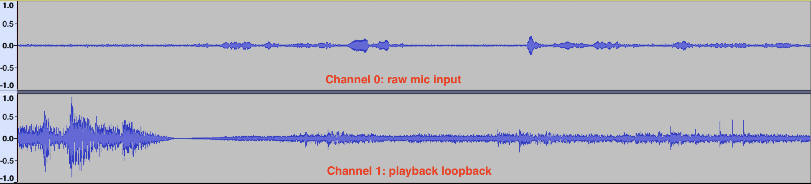
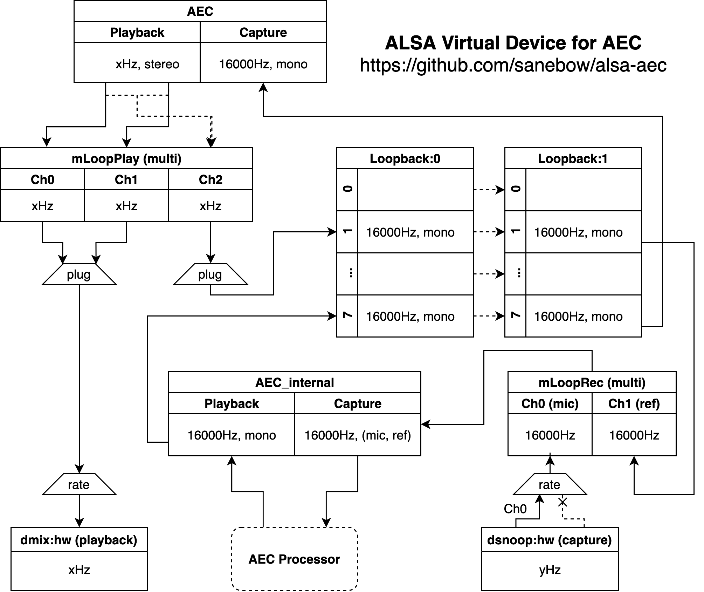

# ALSA AEC
ALSA virtual device which combines recording and playback loopback for AEC processing



## Usage

1. Enable ALSA loopback module with `sudo modprobe snd-aloop`

2. Copy `alsa-aec.conf` to `/etc/alsa/conf.d/50-aec.conf`. Create the the directory if it doesn't exist.

3. Set parameters for the `aec` device. Suppose you use default alsa card for playback and capture, but your capture device only supports 48000Hz sample rate. Then you need to add the following line in your `/etc/asound.conf` or `~/.asoundrc`

   ```
   defaults.pcm.aec.capture_hw.rate 48000
   ```

3. Play some audio through the `aec` device: `aplay -D aec music.wav`
4. While audio is playing, record from the `aec_internal` device: `arecord -D aec_internal -f S16_LE -r 16000 -c 2 rec.wav -V stereo`. Load `rec.wav` in Audacity, you should see two channels, where the first is raw mic recording and the second is the playback loopback (reference).
5. Run AEC processor with `aec_internal` as both the input and the output device, e.g., you can use the `aec.py` from my [PiDTLN](https://github.com/SaneBow/PiDTLN) project.
6. Capture processed clear recording from `aec`: `arecord -D aec -f S16_LE -r 16000 -c 1 rec.wav -V mono`

## Configuraiton

All configurations can be found in `alsa-aec.conf`. Now it supports the following configuations:

```
defaults.pcm.aec.playback_hw.card defaults.pcm.card   # playback hw card 
defaults.pcm.aec.playback_hw.rate 48000               # sample rate supported by the playback card
defaults.pcm.aec.capture_hw.card defaults.pcm.card    # capture hw card
defaults.pcm.aec.capture_hw.rate 16000                # sample rate supported by the capture card
## you may also directly set some PCM device as playback and capture device
defaults.pcm.aec.playback_pcm "playback_hw"      
defaults.pcm.aec.capture_pcm "capture_hw"             
defaults.pcm.aec.pre_loopidx 4    # loopback subdevice index for stream before aec processing
defaults.pcm.aec.post_loopidx 5   # loopback subdevice index for stream after aec processing
```

You can set these parameters in `/etc/asound.conf` or `~/.asoundrc`

Another way to do it is to use device with parameters, e.g., `aec:bluealsa`, `aec_internal:\"\\\"capture_hw:2,48000\\\"\"`  (avoid this because of the ugly and error-prone escapes)

## Troubleshoot

* `arecord: xrun:1664: read/write error, state = RUNNING`
  * Check your setting of `defaults.pcm.aec.capture_hw.rate`. It must be set to a sample rate natively supported by the capture device. 
* `aplay: xrun:1664: read/write error, state = PREPARED`
  * Check your setting of `defaults.pcm.aec.playback_hw.rate`. It must be set to a sample rate natively supported by the playback device.
* If you set `playback_pcm` or `capture_pcm` to other device and see xruns, you can try to wrap the device with a `rate` plugin and set `slave.rate` to a value supported by the device.

[alsacap](https://www.volkerschatz.com/noise/alsa.html#alsacap) is a nice tool to help you find your device's supported sample rates.

## Internal of the AEC Virtual Device



### Story

I created some script (see [PiDTLN](https://github.com/SaneBow/PiDTLN)) to do AEC with assuming the input audio contains both raw mic input and playback in separate channels. Some soundcard has hardware support for this. But I also want to make it happen on soundcards without hardware loopback channel. Even more ambitious, I want to do AEC when playback and capture are not on the same card, e.g., play through bluetooth speaker while recording from USB mic.

There were various approaches in my mind, e.g., use FIFO to combine channels, modify aec script to capture simutanously from both mic and loopback, but I finally determined to do it with only adding some alsa configuration. It is notorious that the `asound.conf` can be very obscure and mysterious, due to the bad documentation. With a few days of googling, trial and error, I finally came up with the ugly solution above.

### High Level Idea

* When players play audio through the `aec` virtual device, we duplicate the stream into two, then pass one to the soundcard while redircting another to the virtual loopback device.
* AEC processor captures audio from the `aec_internal` device. This virtual device fetches mic input to its channel 0, and fetches the previously stored playback from the loopback device into its channel 1.
* After AEC processing, the clear audio is put into the loopback through the `aec_internal` device and can be fetched by other programs with the `aec` device.
* So applications only need to use the `aec` device for playing and recording. AEC processor uses `aec_internal` as input and output device.

### Design Rationale

* **High quality audio play**: While I assume that AEC processor can only handle 16kHz mono audio,  I want my speakers be able to play $x$ kHz stereo audio as usual.  That's why we have separats `plug` for hw and loopback playback devices. Note that the `rate`  above the playback hw is to avoid xruns, see below for details.

* **Support various capture devices**: Capture hardware may only support some sample rates, and may multiple channels. At first I try to wrap it with a `plug` for auto-convertion, but strange things happen (xruns, errors). With trial and error, I finally found that selecting only one channel and set explicit sample rate conversion with the `rate` plugin worked. That's why in the bottom right I put a `rate` instead of a `plug`. If anyone know the reason behind this please tell me.

* **Flexible**: I added a lot of parameters in the device configuration to make it easier to customize. It is not only possible to specify the hardware card you want to use for AEC, but also possible to set a alsa PCM as the playback/capture device. For example, if you want to play on your bluetooth speaker via the `bluealsa` device (see the [bluez-alsa](https://github.com/Arkq/bluez-alsa) project), you can play audio to the device `aec:bluealsa`, or you can set `defaults.pcm.aec.playback_pcm "bluealsa"` in the `~/.asoundrc`.


## References

* [A closer look at ALSA](https://www.volkerschatz.com/noise/alsa.html#alsacap) by volkerschatz
* [ALSA PCM plugins references](https://www.alsa-project.org/alsa-doc/alsa-lib/pcm_plugins.html)
* [Module-aloop](https://www.alsa-project.org/wiki/Matrix:Module-aloop)